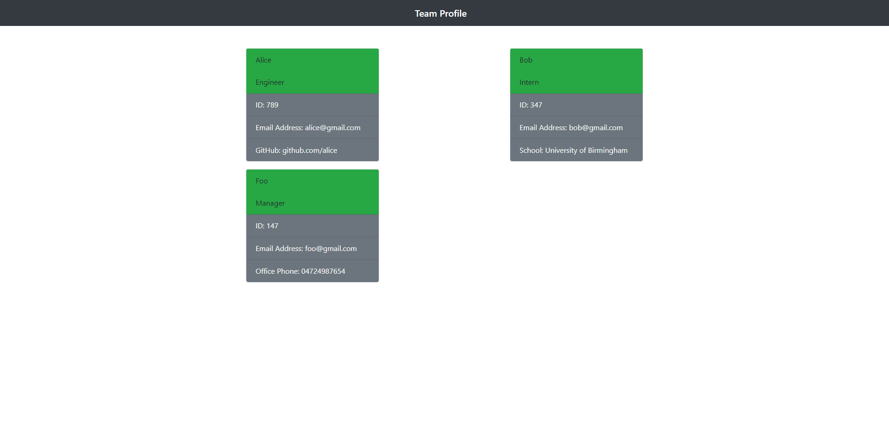
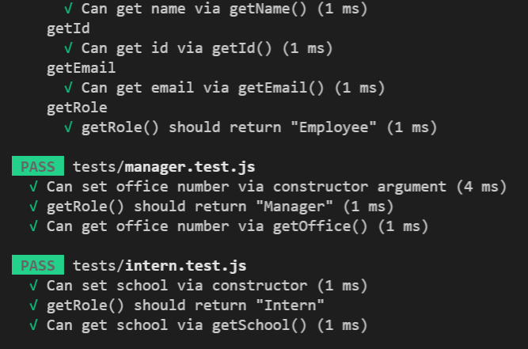
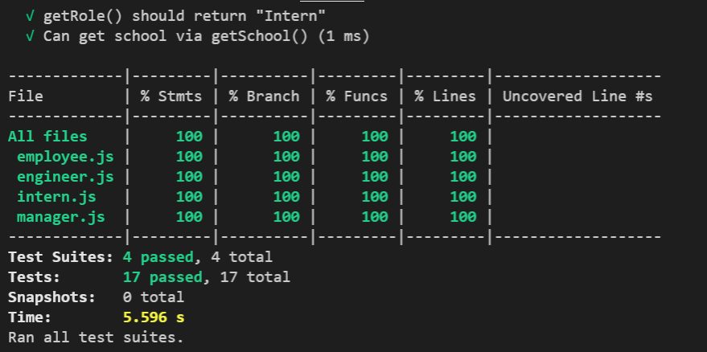

## Team profile generator

# Project Description

The Team Profile Generator is a command-line-input application run in Node that requests information from the user about members of an engineering team and generates an HTML file displaying that information.

- Before running the application the user must perform an npm install to install all required dependencies.
- Upon launching the app, the user is asked to describe the first member of their team.
- The user enters the team member's name, selects that member's role from a list (options include "Engineer," "Intern," and "Manager).
- Enters the member's ID (any string).
- Enters the member's email address.
- Then must enter another piece of information that will differ depending on what role was selected.
- If "Engineer" was selected, the app asks the user for the team member's GitHub username.
- If "Intern" was selected, the member's school is requested.
- If "Manager" was chosen, the user is prompted for the team member's phone number.

Other features:

- This app was created using classes and constructors to create "team member".
- The app is run using Node.js, and uses the "Inquirer" and "FS" node modules.
- Jest is used to perform tests on all the class constructors to ensure that they behave as expected.
- The FS node module is used to generate an HTML file from strings written in JavaScript.

# Screenshots

Testing screenshots: This show that all the test have passed related to employee, engineer, intern and manager.

# Link to the github page

https://etipriya.github.io/team-html-generator/
